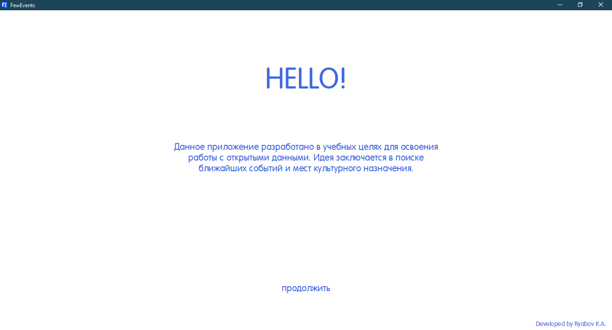
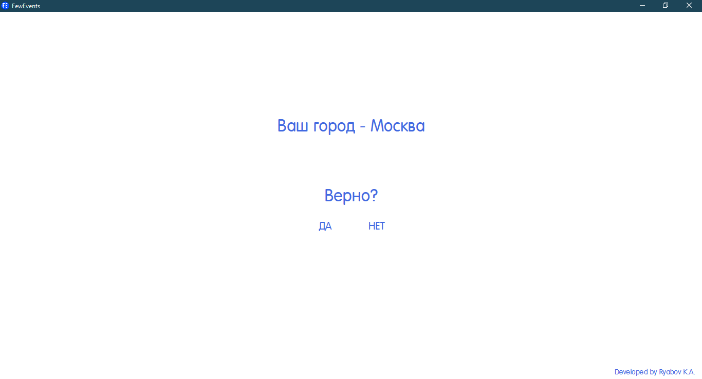
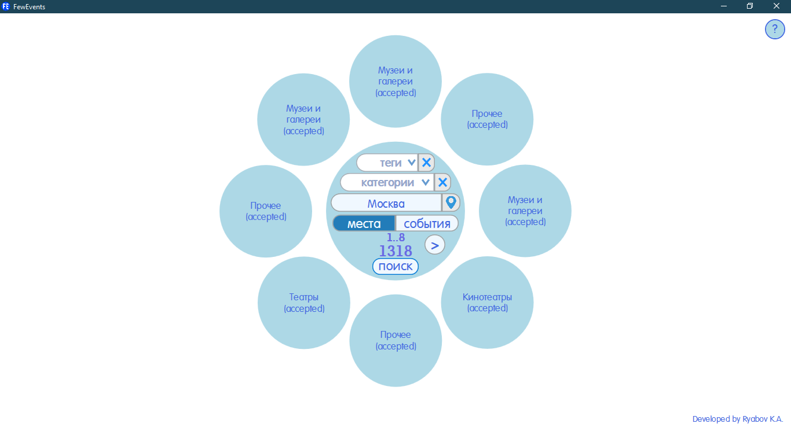

# FewEvents
Designed for educational purposes for working with open data. The application looks for places and events that have happened or are happening in the near future.
---
It uses the geolocation detection service and saves the received data to the geo.json file along the path C: \ Users \ ... \ Documents \ FewEvents.

INFO
=====================

Сity change
=====================

Main
=====================

